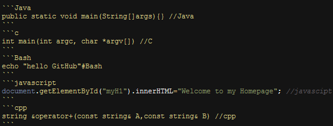

### 简介
[hexo](https://hexo.io/zh-cn/)是一个快速、简洁且高效的静态站点生成框架，它基于 Node.js 。 它有许多的主题框架,小编选择的时[Next](http://theme-next.iissnan.com/)。文档讲解的非常详细,小编就不在这里为大家介绍文档了，就写一些小编出错和注意的点。
### 安装
安装 Hexo 只需几分钟时间，可以[参考官网](https://hexo.io/zh-cn/)，若你在安装过程中遇到问题或无法找到解决方式，请留言，我会尽力解决你的问题。
#### 安装前提
- <a href="https://git-scm.com/download/win" class="fa fa-download"> <b>Git</b></a>
- <a href="https://nodejs.org/en/" class="fa fa-download"> <b>node</b></a>

如果你的电脑中尚未安装所需要的程序，请根据以下安装指示完成安装
#### 安装步骤
- 安装`hexo-cli`
```
npm install -g hexo-cli
```
- 安装完成后在`指定的目录`下执行hexo初始化
```
hexo init
```
- 生成静态文件
```
hexo g

```
- 启动本地静态服务器
```
hexo s
```
- 发布项目
```
hexo d
```
### 常见问题 - 图标显示

Hexo 中的图标使用的是 [Font Awesome](http://fontawesome.io/) ,所以，我们的博客已经自带了 `Font Awesome` 中的所有图标，基本可以满足我们的所有需求，我们可以去 `Font Awesome` 中查找我们想要使用的图标。
```html
 <i class="fa fa-github"></i>
 <i class="fa fa-github fa-lg"></i>
 <i class="fa fa-github fa-2x"></i>
```
### 常见问题 - 代码压缩优化
在项目的根目录下，执行以下命令：

```
cnpm install gulp -g
cnpm install gulp-minify-css gulp-uglify gulp-htmlmin gulp --save-dev
```
然后在 `gulpfile.js` 里面写上相关代码，详情查看 [源码](https://github.com/zhangyapeng0222/person_blogs/blob/master/gulpfile.js) 。

然后执行 `gulp min` 就会根据 `gulpfile.js` 中的配置，对 `public` 目录中的静态资源文件进行压缩。

鼠标右键 -> 查看网页源代码，可以看到已经是压缩过的。

### 常见问题 - 字数统计、阅读时长
Next主题已经集成了字数统计、阅读时长,我们只需要在主题配置文件_config.yml中打开wordcount统计功能即可
```yml
# Post wordcount display settings
# Dependencies: https://github.com/willin/hexo-wordcount
post_wordcount:
  item_text: true
  wordcount: true         # 单篇 字数统计
  min2read: true          # 单篇 阅读时长
  totalcount: false       # 网站 字数统计
  separated_meta: true
```
如果还出现字数统计和阅读时长失效的情况，一般是因为没有安装 `hexo-wordcount` 插件，查看 Hexo 插件：
```
hexo --debug
```
安装 hexo-wordcount 插件
```
npm i --save hexo-wordcount
```
### 常见问题 - 自动备份Hexo博客源文件
#### 原理
通过监听Hexo的事件来完成自动执行Git命令完成自动备份呢？通过查阅Hexo文档，找到了Hexo的主要事件，见下表：

| 事件名 | 事件发生时间 |
|:------|:------|
| deployBefore | 在部署完成前发布 |
| deployAfter | 在部署成功后发布 |
| exit | 在 Hexo 结束前发布 |
| generateBefore | 在静态文件生成前发布 |
| generateAfter |	在静态文件生成后发布 |
| new | 在文章文件建立后发布 |

于是我们就可以通过监听Hexo的`deployAfter`事件，待上传完成之后自动运行Git备份命令，从而达到自动备份的目的。

### 步骤
- 在命令中键入以下命令，完成`shelljs`模块的安装：
```
npm install --save shelljs
```
- 编写自动备份脚本,在Hexo根目录的`scripts`文件夹下新建一个js文件，文件名随意取。如果`没有scripts`目录，请新建一个
```js
require('shelljs/global');

try {
	hexo.on('deployAfter', function() {//当deploy完成后执行备份
		run();
	});
} catch (e) {
	console.log("产生了一个错误<(￣3￣)> !，错误详情为：" + e.toString());
}

function run() {
	if (!which('git')) {
		echo('Sorry, this script requires git');
		exit(1);
	} else {
		echo("======================Auto Backup Begin===========================");
		cd('D:/hexo');    //此处修改为Hexo根目录路径
		if (exec('git add --all').code !== 0) {
			echo('Error: Git add failed');
			exit(1);

		}
		if (exec('git commit -am "Form auto backup script\'s commit"').code !== 0) {
			echo('Error: Git commit failed');
			exit(1);

		}
		if (exec('git push origin master').code !== 0) {
			echo('Error: Git push failed');
			exit(1);

		}
		echo("==================Auto Backup Complete============================")
	}
}
```
    - 其中，需要修改第17行的`D:/hexo`路径为Hexo的根目录路径。（脚本中的路径为博主的Hexo路径）

    - 如果你的Git远程仓库名称不为origin的话，还需要修改第28行执行的push命令，修改成自己的远程仓库名和相应的分支名。

### 常见问题 - 代码高亮
小编刚开始写的代码往往是这样的，[Next代码高亮]完全没有作用(http://theme-next.iissnan.com/theme-settings.html#syntax-highlight-scheme)
```
require('shelljs/global');
```
原来是没有在三个`后加上语言名，如java。



```js
require('shelljs/global');
```
